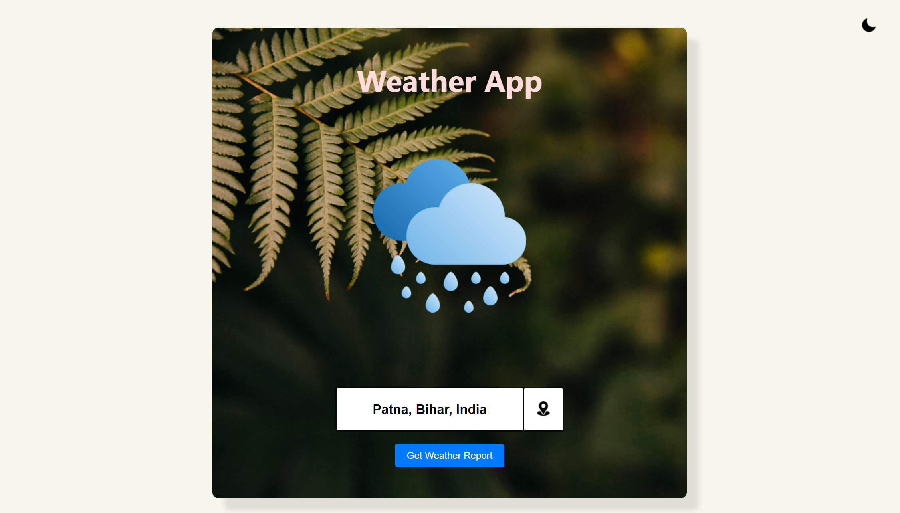
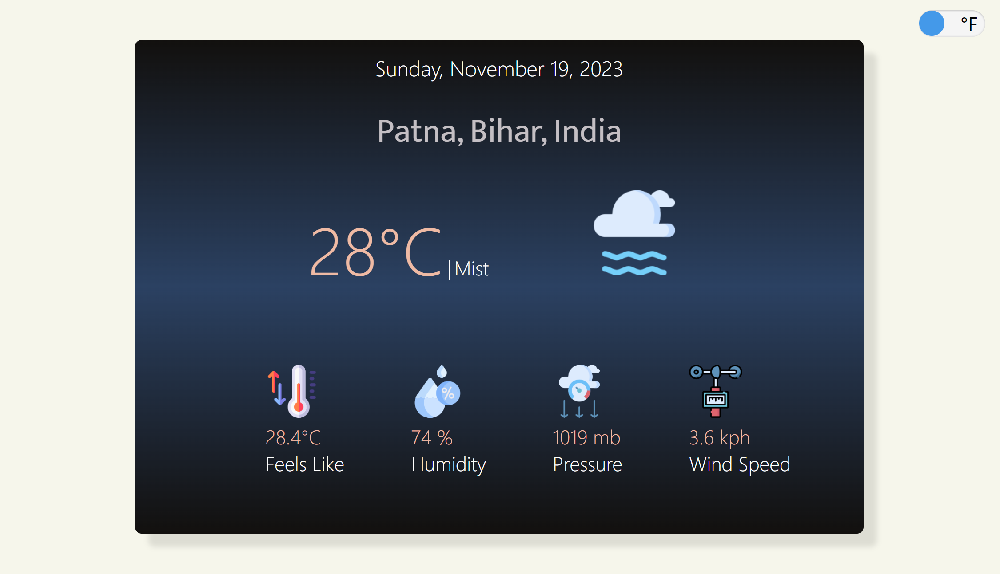

# Vue Weather App

A Weather Application  which tells you temperature, humidity, pressure and wind speed. This is built completely on Vue and it is using a custom golang API which itself calling Weather API .

Input Parameters: Name of the City or place.

API used : [Weather API](https://www.weatherapi.com/) (Free Version)

Any open source contribution is welcomed . This can be a ideal start to open source contribution for any beginner and surely it will be a great learning opportunity for me.

